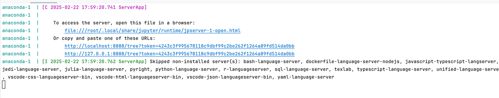

# Conda Container 
Is a docker project to build docker image with:

- [x] Anaconda 3, [Anaconda3-2024.10-1-Linux-aarch64.sh](https://www.anaconda.com/download/success).
- [x] TensorFlow
- [x] keras
- [x] langchain.
- [x] jupyter notebook

## How to run.

- [Install Docker](https://docs.docker.com/get-started/get-docker/).
- Run in project root path `docker compose up --build` or `docker compose up -d --build` to detach the process in the background.
- Find local server has been started, url in logs 
- You can any python notebook in folder/directory [notbooks](./notebooks), so this will be shown in the browser notebooks.

# Ollama Container

## How to run.

- Copy `.env.example` to new file `.env`.
- Default `MODEL` variable is `deepseek-r1:1.5b` you can change it at `.env` for example you can use the higher `deepseek-r1:7b`
- Run by `docker compose up ollama -d`
- Wait until the model get pulled.
- Start chatting through API `http://localhost:11434/api/chat`
- For example check [Postman collection](./Postman/Ollama_chat_endpoint.postman_collection.json)
- Enjoy the chat.

### Do you want Change the model or pull another one?
- Run by `docker compose down ollama`.
- Change `MODEL` variable value in your file `.env` by the new needed model for example `gemma3:1b`
- Run the container again by `docker compose up ollama -d`
- Wait the new Model to be pulled.
- Change your model value in Postman Chat endpoint.
- Enjoy the chat.
> Note: all downloaded model will be still available to be requested.